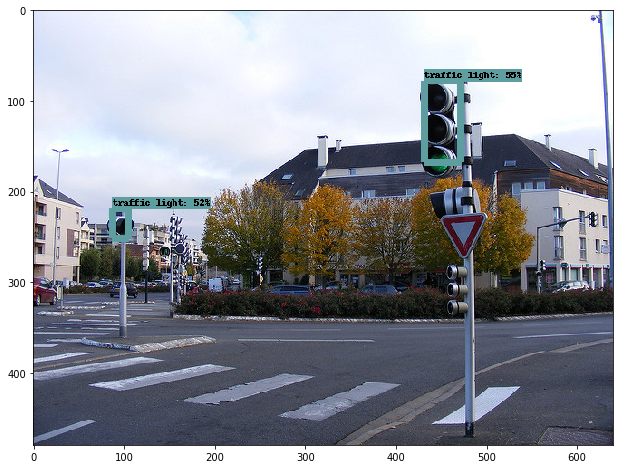

# Traffic-light-classifier
Detection and Classifier for Udacity CarND Capstone (System Integration) Project (WIP)

Um das Model für den Traffic light classifier (oder ein anderes Projekt) zu trainieren
wird die [Tensorflow Object Detection API](https://github.com/tensorflow/models/tree/master/research/object_detection)
benötigt.

Eine Installationsanleitung unter Ubuntu 16.04 bzw. Windows mit Ubuntu Bash gibt er [hier](Installation_Tensorflow.md).

### Informationen
Das erkennen von Ampeln funktioniert mit einem Vortrainiertem Model (z.B. ssd_mobilenet_v1_coco_2017_11_17)
wie im Beispiel [object_detection_tutorial](https://github.com/tensorflow/models/blob/master/research/object_detection/object_detection_tutorial.ipynb)
schon relativ gut und kann in einem Testbild die Ampeln erkennen.


##### Beispiel


Allerdings ist das erkennen der Ampel an sich nicht ausreichend.  
Es muss zusätzlich erkannt werden welche Farbe die Ampel anzeigt.

Dazu ist es notwenig ein Model zu trainieren.

#### 1. Trainieren des Models
Zum trainieren werden Bilder aus dem [Bosch Small Traffic Lights Dataset](https://hci.iwr.uni-heidelberg.de/node/6132) verwendet.  
Da die Tensorflow Object Detection API [TFRecord - Dateien](https://www.tensorflow.org/programmers_guide/datasets#consuming_tfrecord_data)
verwendet muss das Bosch Dataset in eine *.record Datei konvertiert werden.  

Da die *.record Datei eine beachtliche größe hat, wurde sie nicht in dieses Repository
eingecheckt und muss von jedem selbst erstellt werden.

Das Bosch Dataset muss ebenfalls selbst heruntergeladen werden und anschließend in das
Verzeichnis ```data/bosch/dataset_train_rgb``` entzippt werden.

Zum konvertieren dann das Script [data_conversion_bosch.py](./data_conversion_bosch.py) aufrufen.
```
python data_conversion_bosch.py
```
Die fertige TFRecord Datei findet man dann hier: ```output/training.record```
  
An dieser Stelle noch einmal Danke an [**Anthony Sarkis**](https://medium.com/@anthony_sarkis).  
Von ihm ist das [original Script](https://github.com/swirlingsand/deeper-traffic-lights/blob/master/data_conversion_bosch.py).


